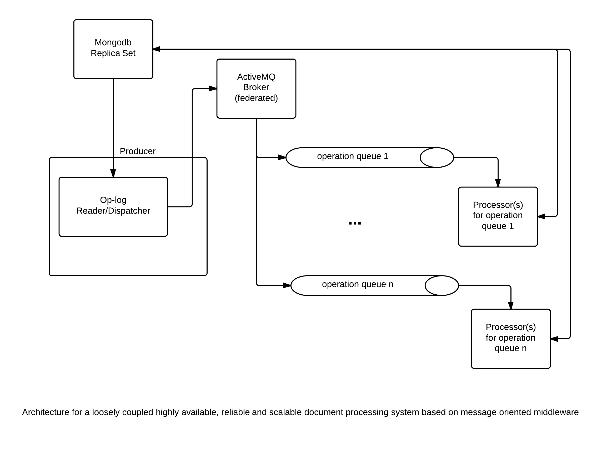

System Architecture
-------------------

## A message oriented middleware based document processing system



The system uses Apache ActiveMQ as message broker.  A producer/dispatcher that hooks
into the oplog of the mongodb replica set fetches any updated/inserted documents and
depending on their status value dispatch them to ActiveMQ persistent point-to-point (PTP) queues.
The messages contain in their body only the MongoDB object id and dispatcher will coalesce multiple documents 
change records of the same status into a single message for better scalability.

For each different operation that can be done on a document there is a different persistent queue and 
each persistent queue serves multiple concurrent consumers that listen on messages they are interested. 
Each message is delivered to a single consumer (PTP) by the dispatcher and the consumer reads the MongoDB 
objectid(s) from the message body to retrieve the document from the MongoDB replica set, process it , 
update the job status and save it back to the MongoDB, which creates a change event in the oplog that is picked 
up by the producer/dispatcher resulting in another message to be queued for that document 
until the document processing pipeline is finished.

The consumers can be written in non Java languages also using the STOMP protocol (http://stomp.github.io). 
There are STOMP clients in Perl, Python, Ruby, C/C++).  
I suggest providing an API to isolate the consumer developer from message processing for each 
of the programming language we will support.


## Data Format Converters

For MongoDB ingestion the XML and CSV formatted documents need to converted to JSON format.
Currently, The system has integrated support for XML to JSON and JSON to XML conversion 
(`org.neuinfo.foundry.common.util.XML2JSONConverter`). 
An CSV to JSON converter is also available as a utility class 
(`org.neuinfo.foundry.common.util.CSV2JSONConverter`).


### XML to JSON conversion
Below is an example JSON mapping snippet 
of   http://hydro10.sdsc.edu/metadata/NOAA_NGDC/053B250F-3EAB-4FA5-B7D0-52ED907A6526.xml

```JSON
{"gmi:MI_Metadata": {
  "@xsi:schemaLocation": "http://www.isotc211.org/2005/gmi http://www.ngdc.noaa.gov/metadata/published/xsd/schema.xsd",
  "gmd:fileIdentifier": {"gco:CharacterString": {"_$": "roms_hiog_forecast/ROMS_Oahu_Regional_Ocean_Model_best.ncd"}},
  "gmd:language": {"gmd:LanguageCode": {
    "@codeList": "http://www.ngdc.noaa.gov/metadata/published/xsd/schema/resources/Codelist/gmxCodelists.xml#LanguageCode",
    "@codeListValue": "eng",
    "_$": "eng"
  }},
  "gmd:characterSet": {"gmd:MD_CharacterSetCode": {
    "@codeList": "http://www.ngdc.noaa.gov/metadata/published/xsd/schema/resources/Codelist/gmxCodelists.xml#MD_CharacterSetCode",
    "@codeListValue": "UTF8",
    "_$": "UTF8"
  }},
  "gmd:hierarchyLevel": [
    {"gmd:MD_ScopeCode": {
      "@codeList": "http://www.ngdc.noaa.gov/metadata/published/xsd/schema/resources/Codelist/gmxCodelists.xml#MD_ScopeCode",
      "@codeListValue": "dataset",
      "_$": "dataset"
    }},
    {"gmd:MD_ScopeCode": {
      "@codeList": "http://www.ngdc.noaa.gov/metadata/published/xsd/schema/resources/Codelist/gmxCodelists.xml#MD_ScopeCode",
      "@codeListValue": "service",
      "_$": "service"
    }},
    ...
```

The following code from `org.neuinfo.foundry.common.util.XML2JSONConverter.testDrive` static method shows 
how to convert a CINERGI XML document to JSON and then  revert back to the XML by preserving order .

```java
  String xmlSource = "http://hydro10.sdsc.edu/metadata/NOAA_NGDC/053B250F-3EAB-4FA5-B7D0-52ED907A6526.xml";
  SAXBuilder builder = new SAXBuilder();
  Document doc = builder.build(xmlSource);
  Element rootEl = doc.getRootElement();

        
  XML2JSONConverter converter = new XML2JSONConverter();
  JSONObject json = converter.toJSON(rootEl);

  System.out.println(json.toString(2));
  XML2JSONConverter converter = new XML2JSONConverter();
  Element docEl = converter.toXML(json);
```

The reverted back XML representation snippet for the JSON snippet above is shown below.

```xml
<?xml version="1.0" encoding="UTF-8"?>
<gmi:MI_Metadata xmlns:gmi="http://www.isotc211.org/2005/gmi" xmlns:csw="http://www.opengis.net/cat/csw/2.0.2" xmlns:gco="http://niem.gov/niem/external/iso-19139-gmd/draft-0.1/gco/dhs-gmo/1.0.0" xmlns:gmd="http://www.isotc211.org/2005/gmd" xmlns:gml="http://www.opengis.net/gml/3.2" xmlns:gmx="http://www.isotc211.org/2005/gmx" xmlns:gsr="http://www.isotc211.org/2005/gsr" xmlns:gss="http://www.isotc211.org/2005/gss" xmlns:gts="http://www.isotc211.org/2005/gts" xmlns:srv="http://www.isotc211.org/2005/srv" xmlns:xlink="http://www.w3.org/1999/xlink" xmlns:xsi="http://www.w3.org/2001/XMLSchema-instance" xsi:schemaLocation="http://www.isotc211.org/2005/gmi http://www.ngdc.noaa.gov/metadata/published/xsd/schema.xsd">
  <gmd:fileIdentifier>
    <gco:CharacterString>roms_hiog_forecast/ROMS_Oahu_Regional_Ocean_Model_best.ncd</gco:CharacterString>
  </gmd:fileIdentifier>
  <gmd:language>
    <gmd:LanguageCode codeList="http://www.ngdc.noaa.gov/metadata/published/xsd/schema/resources/Codelist/gmxCodelists.xml#LanguageCode" codeListValue="eng">eng</gmd:LanguageCode>
  </gmd:language>
  <gmd:characterSet>
    <gmd:MD_CharacterSetCode codeList="http://www.ngdc.noaa.gov/metadata/published/xsd/schema/resources/Codelist/gmxCodelists.xml#MD_CharacterSetCode" codeListValue="UTF8">UTF8</gmd:MD_CharacterSetCode>
  </gmd:characterSet>
  <gmd:hierarchyLevel>
    <gmd:MD_ScopeCode codeList="http://www.ngdc.noaa.gov/metadata/published/xsd/schema/resources/Codelist/gmxCodelists.xml#MD_ScopeCode" codeListValue="dataset">dataset</gmd:MD_ScopeCode>
  </gmd:hierarchyLevel>
  <gmd:hierarchyLevel>
    <gmd:MD_ScopeCode codeList="http://www.ngdc.noaa.gov/metadata/published/xsd/schema/resources/Codelist/gmxCodelists.xml#MD_ScopeCode" codeListValue="service">service</gmd:MD_ScopeCode>
  </gmd:hierarchyLevel>

```

### CSV to JSON conversion

Below is the code necessary for conversion of a CSV file with a header line (true flag to  CSV2JSONConverter constructor) to JSON
```java
String csv = Utils.loadAsString("/tmp/urls.csv");
CSV2JSONConverter converter = new CSV2JSONConverter(true);

JSONObject json = converter.toJSONFromString(csv);
System.out.println(json.toString(2));

```

The CSV data exported from MS Excel 
```
"ModelDB Paper title","ModelDB URL","ModelDb PMID",,"NER PMID","NER date of Pub","NER Journal"
"Peterson BE, Healy MD, Nadkarni PM, Miller PL, Shepherd GM (1996) ModelDB: an environment for running and storing computational models and their results applied to neuroscience. ",http://www.ncbi.nlm.nih.gov/entrez/query.fcgi?cmd=Retrieve&amp;db=PubMed&amp;list_uids=8930855,8930855,,7576889,1995/08/12,"Journal of paediatrics and child health"
```

results in the following JSON format

```JSON
{"rows": [
  {
    "ModelDB_Paper_title": "Peterson BE, Healy MD, Nadkarni PM, Miller PL, Shepherd GM (1996) ModelDB: an environment for running and storing computational models and their results applied to neuroscience.",
    "ModelDB_URL": "http://www.ncbi.nlm.nih.gov/entrez/query.fcgi?cmd=Retrieve&amp;db=PubMed&amp;list_uids=8930855",
    "ModelDb_PMID": "8930855",
    "": "",
    "NER_PMID": "7576889",
    "NER_date_of_Pub": "1995/08/12",
    "NER_Journal": "Journal of paediatrics and child health"
  },

```
